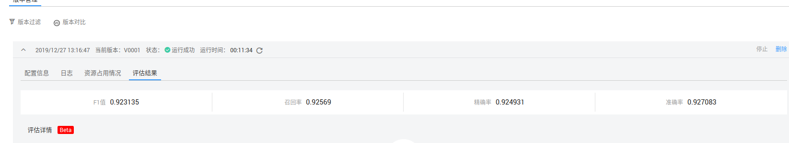
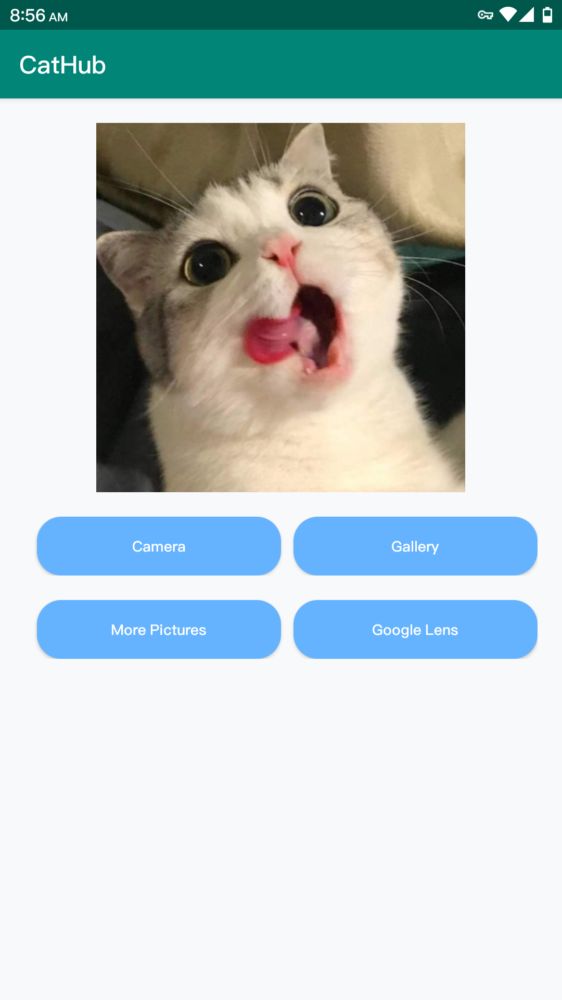
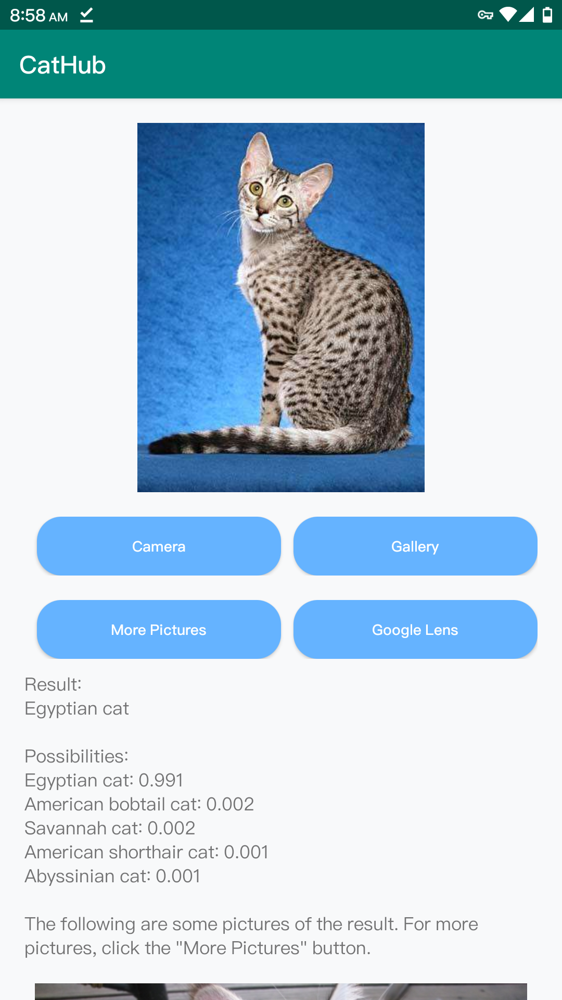
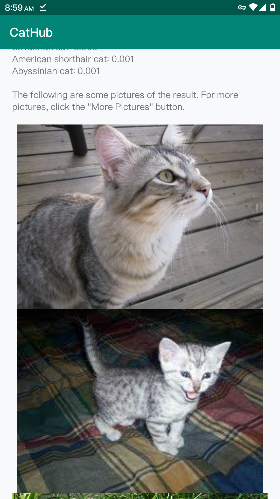
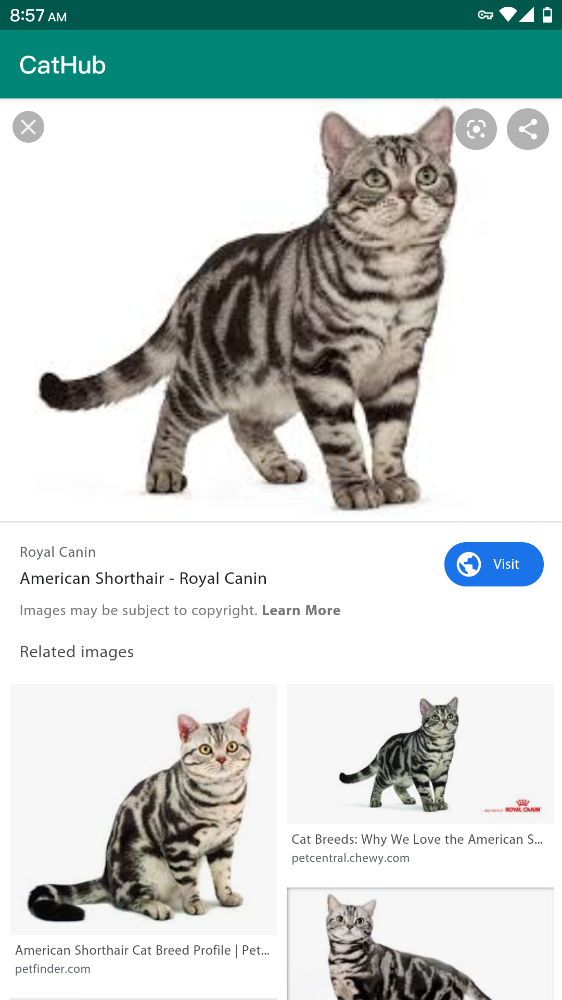

# Project CatHub

### Introduction

In this project our team design an Android application to recognize the kind of a cat and provide some other relevant function using ModelArts platform.

### Functions

 User can select a pic of cat in their phone or take a pic now to upload. Then the result is displayed with some sample pics of the  kind of cat recognized. In addition, user could hit the "More" button to see more sample photos in google image. In addition, user could click on the "Google lens" button to launch google lens app for more precise recognition. 

Notice: due to limited amount of data, only around 30 kinds of cat could be recognized. The theoretical accuracy calculated by ModelArts of this project is approximately 92%. 

### Screenshots of application

### Acknowledgement

Thanks Huawei for providing such a wonderful AI platform.

Thanks [zxzxzxygithub](https://github.com/zxzxzxygithub) for providing a framework of the Android application. Link of the repository: [click me](https://github.com/zxzxzxygithub/hwmodelartdemo/).

